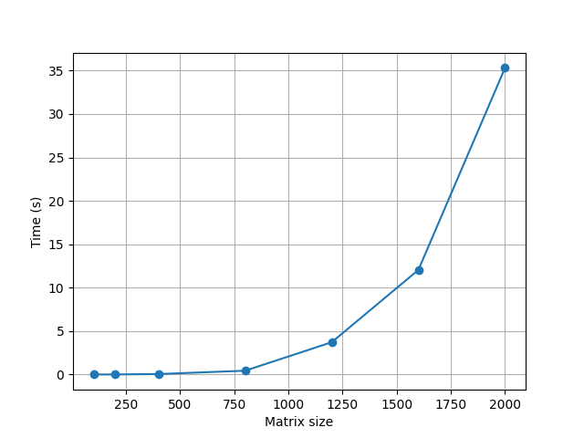
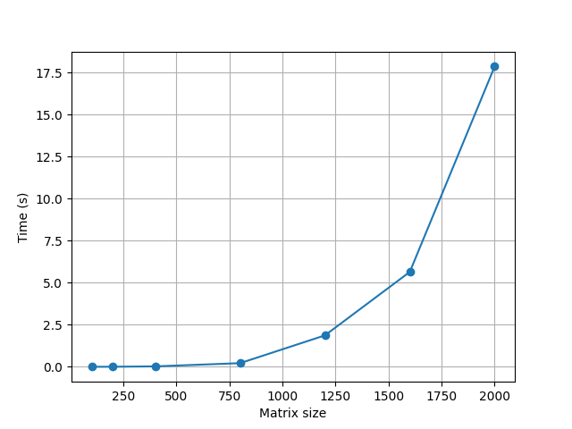
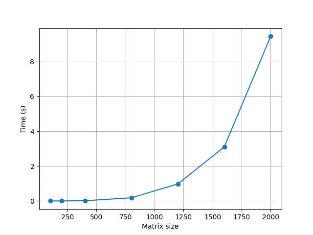
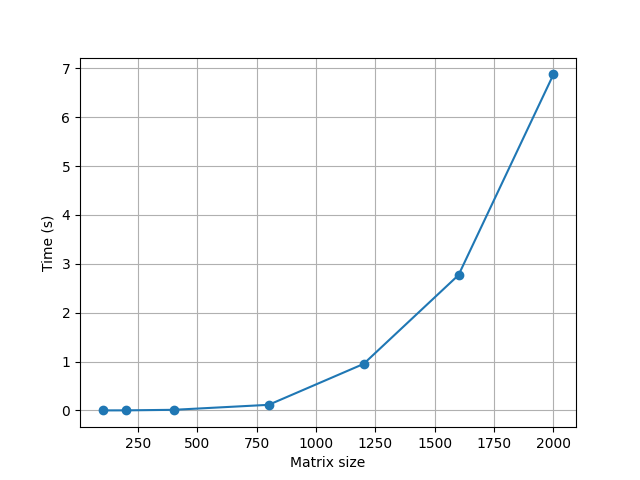
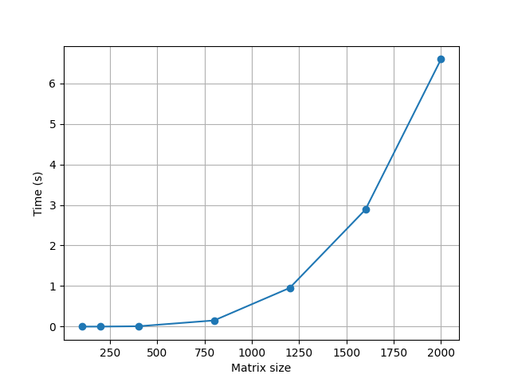

Лабораторная работа 2 (OpenMP)
Суть задания:

Модифицировать программу из л/р №1 для параллельной работы по технологии OpenMP. Провести серию экспериментов с разным количеством потоков (1, 2, 4, 8 и т.д.), разными размерами матриц (примерно 200, 400, 800, 1200, 1600, 2000), с разным количеством вычислительных ядер (1, 2, 4, 8 и т.д.).

Требовалось:

распараллелить умножение квадратных матриц;
провести эксперименты для разных размеров матриц;
сравнить время работы при различном числе потоков;
проверить поведение программы при разном количестве доступных вычислительных ядер;
сохранить автоматическую верификацию результата через стороннее ПО.

Структура проекта:
main_omp.c - реализация умножения матриц с использованием OpenMP;
main.c - последовательная версия программы (из ЛР №1);
check.py - проверка корректности результата через NumPy;
mtrx/ - входные матрицы;
mtrx_omp/ - выходные матрицы для OpenMP-версии;
timing_omp/ - файлы с результатами измерения времени;
graph_build.py - построение графиков по результатам экспериментов.

Подготовка входных данных

Входные данные (квадратные матрицы) используются из заранее сгенерированных файлов.

Матрицы хранятся в директории: mtrx/
Каждая матрица соответствует определённому размеру N:

A200.txt, B200.txt
A400.txt, B400.txt

Реализация OpenMP
Параллелизация выполнена с использованием директивы: #pragma omp parallel for schedule(static)
Параллелизация применяется к внешнему циклу по строкам результирующей матрицы.
Число потоков задаётся вручную пользователем и устанавливается через: omp_set_num_threads(threads)

Автоматическая проверка

Корректность результата проверяется с использованием Python и NumPy.
Скрипт сравнивает:
результат C-программы
результат A @ B

Сбор экспериментальных данных

Во время выполнения программы фиксируются:

размер матрицы N;
число потоков OpenMP;
время выполнения алгоритма.

Результаты записываются в файл:
timing_omp/time_log1.txt

Формат записи:
N threads time

Пример:
400 4 0.303000
800 4 2.733000

Построение графиков

Для визуализации результатов по прежнему используется Python программа
python graph_build.py

ниже можно увидеть зависимость времени выполнения от количества потоков и размера матрицы:

1 поток

2 потока

4 потока

6 потоков

8 потоков

12 потоков

Вывод

В ходе работы последовательная программа умножения квадратных матриц была успешно преобразована в параллельную версию на основе OpenMP.
Была сохранена совместимость с предыдущей лабораторной работой и добавлены средства для экспериментального анализа производительности.
В результате установлено, что использование многопоточности позволяет существенно ускорить вычисления при больших размерах матриц, однако эффективность зависит от количества потоков и аппаратной конфигурации процессора.
